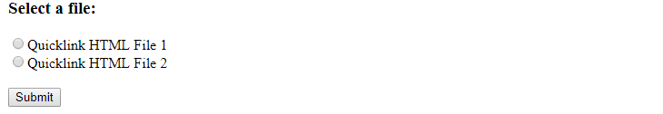
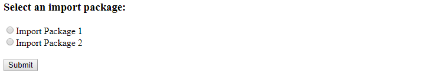

# Remote Plugins Using CIM
This sample project provides three routes that can be used to setup the three types of Content Item Message Remote Plugins that Brightspace provides as extensibility points. The three types of Remote Plugins implemented in this sample are:
* Quicklink (CIM)
* Insert Stuff (CIM)
* Course Import (CIM)


## Setting up a Remote Plugin
You can view how to setup a Remote Plugin in Brightspace by visiting the [documentation](https://community.d2l.com/brightspace/kb/articles/4852-adding-a-content-item-message-certified-third-party-tool) site. When setting up the remote plugin make sure to set the Launch Point URL to be the routes described below. Also make sure that the secret matches the ```ltiSecret``` in the configurations file as discussed [here](configurations.md).

## Quicklink (CIM)
```
Endpoint: /lti/quicklinkcontent
```
* The example Quicklink (CIM) implementation in this project can be found in the [quicklink-cim.js](../src/remote-plugins/quicklink-cim.js) file. 
* The frontend can be found in the [quicklink-cim.html](../html/quicklink-cim.html) file. The frontend is the UI that the user is presented with when interacting with the Quicklink plugin in Brightspace and looks like:



* The user is given two options for adding a file to their content. The files uploaded based on their selection can be found in the [content/quicklink](../content/quicklink) folder.

### Quicklink Workflow
1. User selects the added plugin in content and a request is made to the ```/lti/quicklinkcontent``` endpoint.
2. The incoming request is verified (using OAuth 1.0) to ensure it is an authorized request.
3. The ```content_item_return_url``` is saved for later use as this is the endpoint we need to submit the form to after the user has selected their desired content to be added.
4. User is redirected to the ```quicklink-cim.html``` frontend.
5. Once a user has selected one of the two options and click submit, a call is made to ```/getquicklinkdetails``` which is responsible for generating the request including the OAuth 1.0 parameters and returning these details in a JSON block.
6. After getting the response from Step 5, the values for the form are populated and the form is submitted to the endpoint saved in Step 3.
7. The selected content file is added to the course in Brightspace where the request originated from.


## Insert Stuff (CIM)
```
Endpoint: /lti/isfcontent
```
* The example Insert Stuff (CIM) implementation in this project can be found in the [isf-cim.js](../src/remote-plugins/isf-cim.js) file. 
* The frontend can be found in the [isf-cim.html](../html/isf-cim.html) file. The frontend is the UI that the user is presented with when interacting with the Insert Stuff framework in Brightspace and looks like:


* The user is given two options for adding an image to their text box. The images added to their text box based on their selection can be found in the [content/isf](../content/isf) folder.

### Insert Stuff Workflow
1. User selects the added remote plugin in an insert stuff available area (eg. rich text boxes throughout Brightspace) and a request is made to the ```/lti/isfcontent``` endpoint.
2. The incoming request is verified (using OAuth 1.0) to ensure it is an authorized request.
3. The ```content_item_return_url``` is saved for later use as this is the endpoint we need to submit the form to after the user has selected their desired content to be added.
4. User is redirected to the ```isf-cim.html``` frontend.
5. Once a user has selected one of the two options for an image and click submit, a call is made to ```/getisfdetails``` which is responsible for generating the request including the OAuth 1.0 parameters and returning these details in a JSON block.
6. After getting the response from Step 5, the values for the form are populated and the form is submitted to the endpoint saved in Step 3.
7. The selected image is added to the user's text box in Brightspace.

## Course Import (CIM)
```
Endpoint: /lti/courseimport
```
* The example Content Import (CIM) implementation in this project can be found in the [courseimport-cim.js](../src/remote-plugins/courseimport-cim.js) file. 
* The frontend can be found in the [courseimport-cim.html](../html/courseimport-cim.html) file. The frontend is the UI that the user is presented with when interacting with the selected Course Import plugin in Brightspace and looks like:



* The user is given two options for importing a D2L package to their course. The available D2L packages that can be imported be found in the [content/importpackage](../content/importpackage) folder.

### Course Import Workflow
1. User selects the added remote plugin in the Import option in content and a request is made to the ```/lti/courseimport``` endpoint.
2. The incoming request is verified (using OAuth 1.0) to ensure it is an authorized request.
3. The ```content_item_return_url``` is saved for later use as this is the endpoint we need to submit the form to after the user has selected their desired package to be imported.
4. User is redirected to the ```courseimport-cim.html``` frontend.
5. Once a user has selected one of the two options for an package and click submit, a call is made to ```/getcourseimportdetails``` which is responsible for generating the request including the OAuth 1.0 parameters and returning these details in a JSON block.
6. After getting the response from Step 5, the values for the form are populated and the form is submitted to the endpoint saved in Step 3.
7. The Import process is initiated with the selected package.
